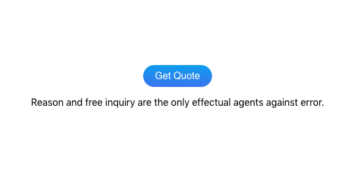

# API calls to fetch data using axios on React

<h3>Description</h3>
This is a simple button project that fetches a random quote from an API call and displays that quote with axios using a response callback function and catch for errors.

## Available Scripts

In the project directory, you can run:

### `npm start`

Runs the app in the development mode.\
Open [http://localhost:3000](http://localhost:3000) to view it in your browser.

